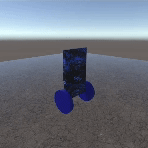

# Self-Balancing Car Project



## Overview

This project aims to develop a self-balancing two-wheeled car using Unity ML-Agents. The car is trained using reinforcement learning to maintain its balance while moving. The project showcases the integration of Unity's physics engine with ML-Agents to create an intelligent agent capable of learning complex behaviors.

## Features

- **Reinforcement Learning**: Utilizes Unity ML-Agents with Proximal Policy Optimization (PPO) to train the car to balance itself.
- **Realistic Physics**: Leverages Unity's physics engine for accurate simulation.
- **Customizable Reward System**: Fine-tuned reward system to encourage balancing behavior.

## Getting Started

### Prerequisites

- Unity 2020.3 or later
- Unity ML-Agents Toolkit
- Python 3.6 or later (for training the agent)

### Installation

1. **Clone the Repository**:

   ```bash
   git clone https://github.com/yourusername/self-balancing-car.git
   cd self-balancing-car
   ```

2. **Open the Project in Unity**:

   - Open Unity Hub.
   - Click on `Add` and select the cloned project folder.

3. **Install ML-Agents**:

   - Follow the [ML-Agents installation guide](https://github.com/Unity-Technologies/ml-agents/blob/main/docs/Installation.md).

4. **Install Python Dependencies**:
   - Ensure you have Python 3.6 or later installed.
   - Install the required Python libraries using `requirements.txt`:
     ```bash
     pip install -r requirements.txt
     ```

### Training the Agent

1. **Configure the Training Environment**:

   - Open the `BalancingAgent` scene.
   - Ensure the `BalancingAgent` GameObject is properly configured with the necessary components.

2. **Start Training**:
   - Open a terminal and navigate to the project directory.
   - Run the following command to start training:
     ```bash
     mlagents-learn config/trainer_config.yaml --run-id=balancing_car
     ```
   - Press the `Play` button in the Unity Editor to start the simulation.

### Using the Pre-trained Model

1. **Import the Model**:

   - Import the saved model into the Unity project.

2. **Assign the Model**:

   - Assign the pre-trained model to the `Behavior Parameters` component of the `BalancingAgent` GameObject.

3. **Run the Simulation**:
   - Press the `Play` button in the Unity Editor to see the self-balancing car in action.

## Project Structure

- **Assets/**: Contains all Unity assets, including scripts, prefabs, and scenes.
- **Scripts/**: Contains C# scripts for the project.
  - `BalancingAgent.cs`: Defines the agent's behavior and reward system.
- **config/**: Contains configuration files for training the agent.

## Key Components

### BalancingAgent.cs

Handles the agent's lifecycle methods, including:

- `OnEpisodeBegin()`: Resets the environment at the start of each episode.
- `OnActionReceived()`: Applies actions and assigns rewards.
- `CollectObservations()`: Collects observations for the agent.
- `Heuristic()`: Provides manual control for testing.

## Contributing

Contributions are welcome! Please open an issue or submit a pull request for any improvements or bug fixes.

## License

This project is licensed under the MIT License. See the LICENSE file for details.

## Acknowledgements

- [Unity ML-Agents Toolkit](https://github.com/Unity-Technologies/ml-agents)
- [Unity Documentation](https://docs.unity3d.com/Manual/index.html)

## Contact

For any questions or inquiries, please contact [lansarifedi7@gmail.com](mailto:lansarifedi7@gmail.com).
